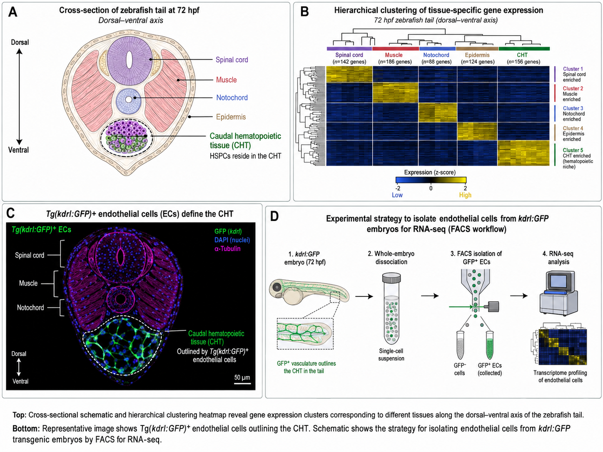
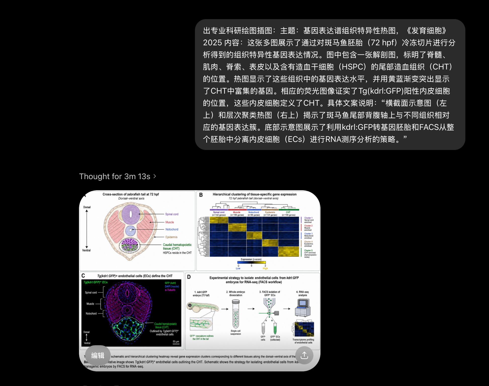
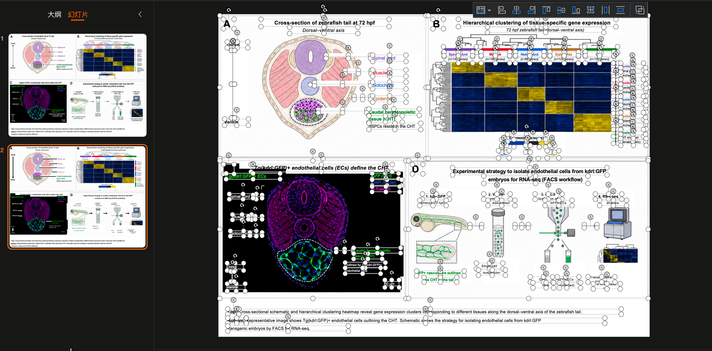
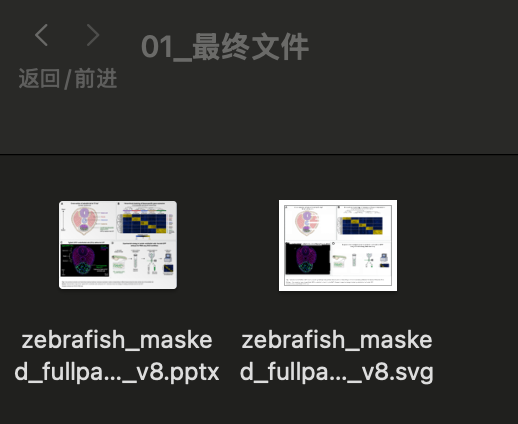
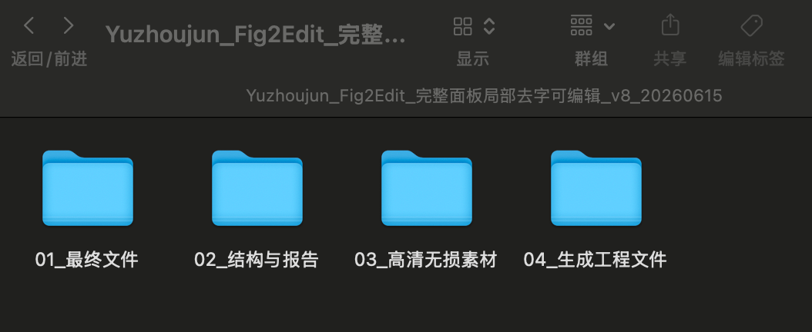

# Zebrafish Figure Example

这是 `Yuzhoujun Fig2Edit` 的内置测试案例，使用一张斑马鱼科研复合图演示商业交付模式。

## 输入

```text
examples/zebrafish/source_zebrafish_tail.png
```




## 案例名称

**基因表达谱组织特异性热图**

这张图是在 `image2` 模型里生成的科研绘图案例。

具体关键词：

```text
出专业科研绘图插图：主题：基因表达谱组织特异性热图，《发育细胞》2025

内容：这张多图展示了通过对斑马鱼胚胎（72 hpf）冷冻切片进行分析得到的组织特异性基因表达情况。图中包含一张解剖图，标明了脊髓、肌肉、脊索、表皮以及含有造血干细胞（HSPC）的尾部造血组织（CHT）的位置。热图显示了这些组织中的基因表达水平，并用黄蓝渐变突出显示了CHT中富集的基因。相应的荧光图像证实了Tg(kdrl:GFP)阳性内皮细胞的位置，这些内皮细胞定义了CHT。

具体文案说明：“横截面示意图（左上）和层次聚类热图（右上）揭示了斑马鱼尾部背腹轴上与不同组织相对应的基因表达簇。底部示意图展示了利用kdrl:GFP转基因胚胎和FACS从整个胚胎中分离内皮细胞（ECs）进行RNA测序分析的策略。”
```

image2 关键词截图：



## 生成命令

```bash
python3 scripts/prepare_highres_assets.py \
  examples/zebrafish/source_zebrafish_tail.png \
  examples/zebrafish/output_v8/03_高清无损素材/highres \
  --scale 2

python3 scripts/build_zebrafish_masked_fullpanel_editable_v8.py \
  examples/zebrafish/output_v8/03_高清无损素材/highres/source_highres_2x.png \
  examples/zebrafish/output_v8
```

## 输出

```text
examples/zebrafish/output_v8/01_最终文件/zebrafish_masked_fullpanel_editable_v8.pptx
examples/zebrafish/output_v8/01_最终文件/zebrafish_masked_fullpanel_editable_v8.svg
examples/zebrafish/output_v8/02_结构与报告/scene_manifest.json
examples/zebrafish/output_v8/02_结构与报告/run_report.md
```

最终 PPT 可编辑工作页预览：



最终文件：



输出目录结构：



## 设计说明

- 第 1 页：原始保真版，四个完整高清面板作为图片图层。
- 第 2 页：完整面板局部去字可编辑版，底层仍是完整面板 PNG，文字/箭头区域被局部遮盖后重建为可编辑对象。
- SVG：使用 masked full-panel 图层和可编辑标题/caption。

中间高清素材目录 `03_高清无损素材/` 可由上面的命令重新生成，未提交到仓库以避免仓库过大。
